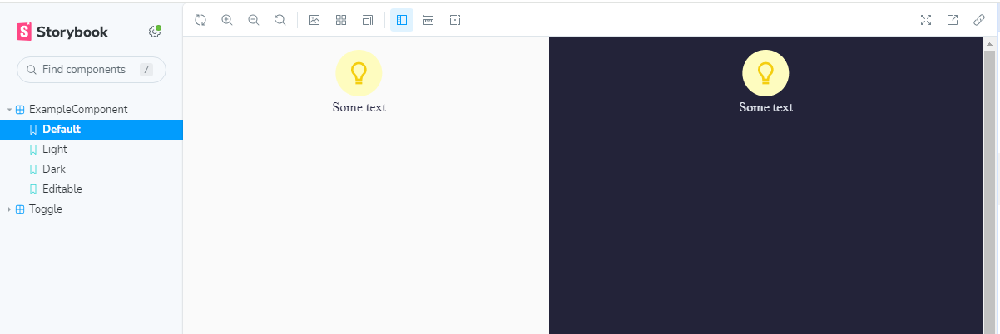
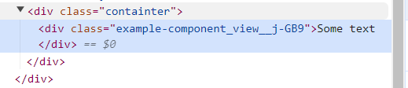

# Инициализация проекта

1. Выполнить `npm install`
2. Для запуска проекта `npm run start`
3. Проект откроется автоматически. Если нет, то открыть `http://localhost:3000/`

Для запуска сторибука выполнить `npm run storybook`.
Можно запускать параллельно с основным приложением в отдельном терминале

# Технологии

В проекте используются следующие технологии

- React [ссылка](https://react.dev/)
- Typescript [ссылка](https://scriptdev.ru/guide/)
- Scss
- Storybook
- Prettier
- Eslint
- Husky

# Storybook

Сторибук предназначен для изолированной разработки компонентов. Это значит, что можно разрабатывать компоненты независимо от окружения. Такой подход помогает при разработке компонентов для сложных проектов или для компонентов со сложной логикой (например, когда при каждом обновлении страницы приходится совершать какие-то действия, чтобы этот компонент появился на странице).

Также в сторибук был добавлен аддон, который позволяет переключать темы компонентов или смотреть их одновременно в split view сразу в двух темах одновременно

Пример истории смотреть в
[example-component.stories](src/components/example-component/example-component.stories.ts)

# Typescript

Обязательно использования базовой типизации в проекте. Как минимум для Props.

Базовые понятия Typescript, которые необходимы для работы над проектом:

- [Аннотация типов](https://scriptdev.ru/guide/011/)
- [Примитивные типы 1](https://scriptdev.ru/guide/013/)
- [Примитивные типы 2](https://scriptdev.ru/guide/014/)
- [Примитивные типы 3](https://scriptdev.ru/guide/015/)
- [Object, Array типы](https://scriptdev.ru/guide/019/)
- [Function, Functional Types](https://scriptdev.ru/guide/020/)

Пример использования можно посмотреть в примере компоненте [Component](https://react.dev/learn/your-first-component#defining-a-component)

# Подход

Все компоненты должны быть написаны в функциональном стиле [Component](https://react.dev/learn/your-first-component#defining-a-component)

Каждый компонент должен лежать в отдельной папке и состоять минимум из следующих файлов:

- component-name.tsx
- component-name.scss
- component-name.stories.ts

Также проект поддерживает css модули. \
_Предпочтительный метод_ \
Их использование рекомендуется, но остаётся на усмотрение. Удобство заключается в том, что скоуп класса гарантированно не пересечется с остальными компонентами из-за генерации имени вида "componentName-className\_\_[hash]"
[example-component.module.scss](src/components/example-component/example-component.module.scss)

Разница использования обычных классов и модульных наглядно:

Если в качестве базового метода был выбран не-модульный подход - контейнер нужно назвать именем компонента `.exampleComponent`, чтобы изолировать стили внутри.

Также в корне компонента можно находиться папка assets в которой могут храниться иконки/svg и т.д.

Все компоненты, которые пишутся, должны быть продуманы для использования исходя из следующих требований:

Два состояния:

- View
- Editable (состояние в фигме не отражено, но предполагается, что в будущем пользователь сможет редактировать информацию вручную)

Переключение темы:

- dark
- light

Если компонент предусматривает вариативность иконок - он должен принимать пропс, который будет отвечать за нужную иконку.

Пример компонента
[example-component.stories](src/components/example-component/example-component.stories.ts)

# Тёмная / Светлая тема

Переключение осуществляется через React.Context. Для её использования нет необходимости в вызове дополнительных функций. Достаточно лишь добавлять/использовать общие цветовые переменные в [common-colors.scss](./src/common/common-colors.scss)

# Фигма

[Ссылка на дизайн](<https://www.figma.com/file/CbPV5aYzGNz8tT0dcNTvsj/Supa-Resume---Light-%26-Dark-%5BFREE-Resume%2FCover-Letter%5D-(Community)-(Copy)?type=design&node-id=503-11392&mode=design&t=16lteaqmHvjgpXhB-0>)
